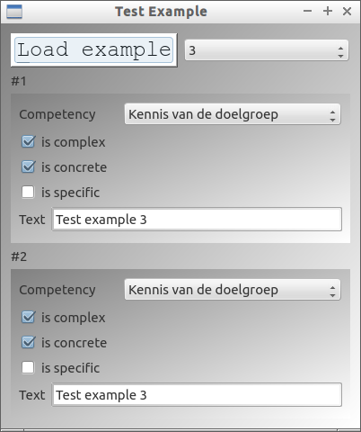
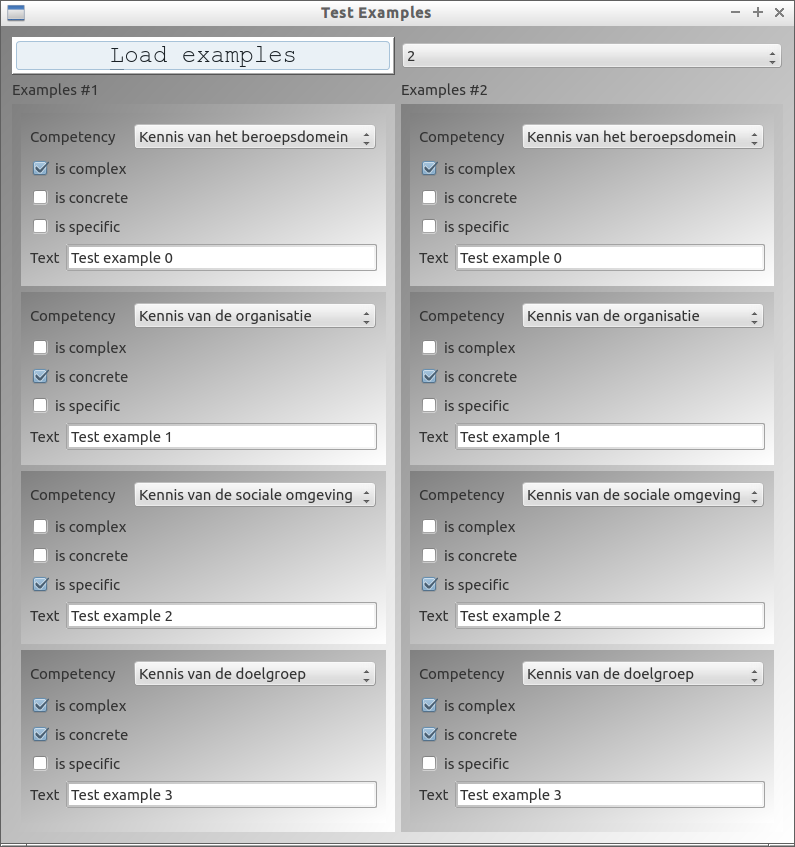
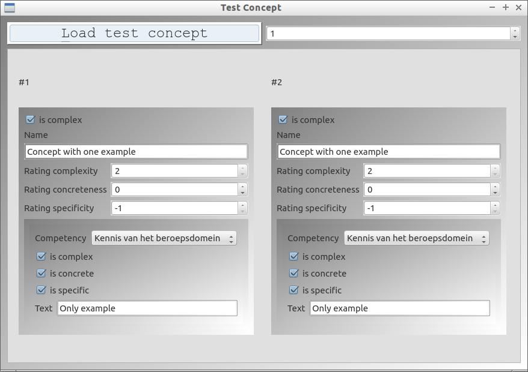

TestConceptMap
==============

TestConceptMap is a tool to test ConceptMap classes

# Test Example

Gives an Example to two QtExampleDialogs. It should be impossible to have these dialogs display different values.

# Test Examples

Gives an Examples to two QtExamplesDialogs. It should be impossible to have these dialogs display different values.

# Test Concept

Gives an Concept to two QtConceptDialogs. It should be impossible to have these dialogs display different values.

# Test Node

Gives a Node to two QtNodeDialogs. It should be impossible to have these dialogs display different values.

